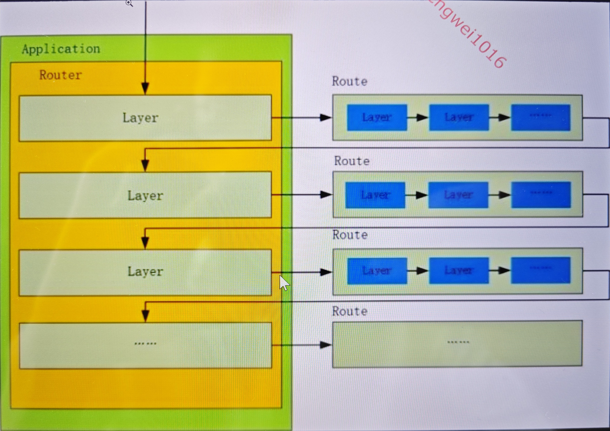
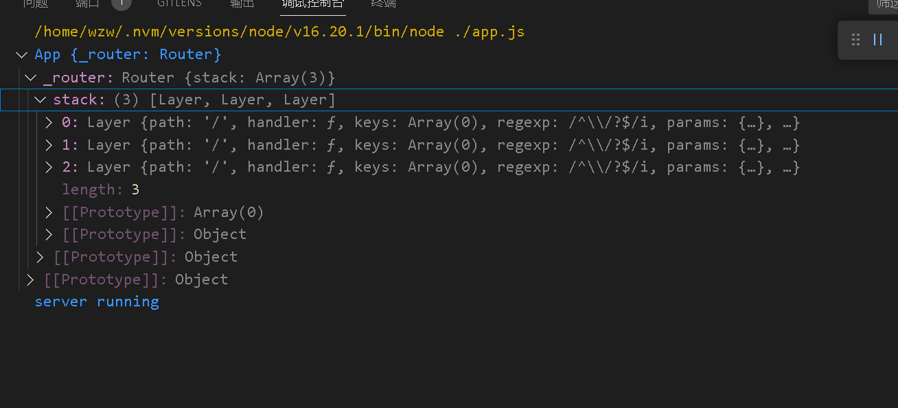
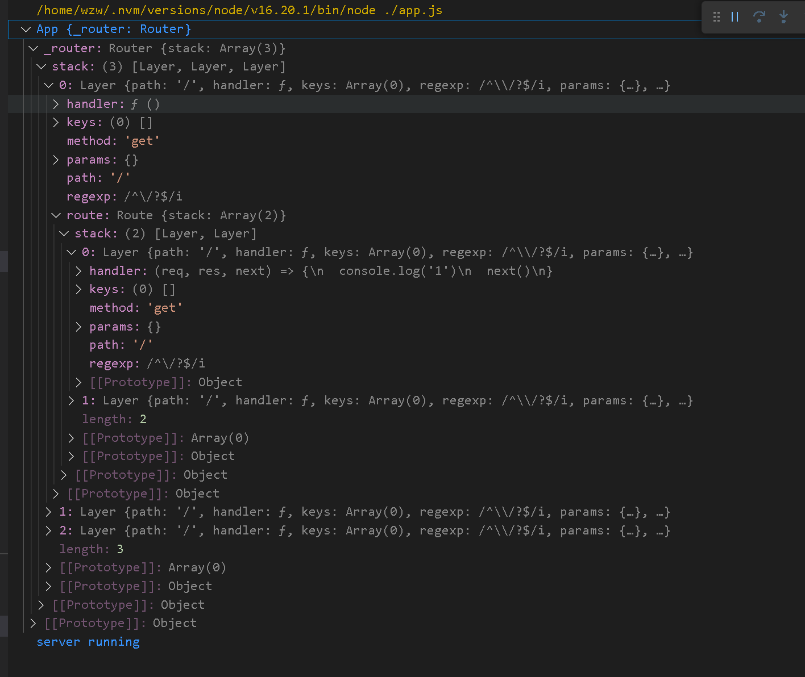

# 模拟 express 

## feature

* 各请求拦截方法
  * app.get
  * app.post
  * ...
* 多中间件顺序执行
* app.listen
* app.use

## 主要思路

将每个独立注册的路由以 Layer 的形式存储在 Router 的 stack 结构内，每个独立注册的路由上又绑定了该路由内的所有中间件

图示如下：



接收到请求后依次执行中间件的逻辑可见 /lib/router/index.js 的 `Router.prototype.handle` 方法和 /lib/router/route.js 的 `Route.prototype.dispatch` 方法


```js
App { // 0
  Router {
    stack [
      Layer { // 1
        handler, // 这个 handler 实际指向对应 Route 实例的 dispacth 方法
        Route: {
          dispatch,
          stack [
            Layer, // 2
            Layer, // 3
          ]
        }
      },
      Layer { // 4
        handler,
        Route: {
          dispatch,
          stack [] // 5
        }
      },
      Layer { // 6
        handler,
        Route: {
          dispatch,
          stack [] // 7
        }
      },
    ]
  }  
}
```
上述结构每一处注释与下例代码中的数字对应


例：

```js
const app = express() // 0

app.get( // 1
  '/',
  (req, res, next) => { // 2
    console.log('1')
    next()
  }, (req, res, next) => { // 3
    console.log('-')
    next()
  }
)

app.get( // 4
  '/',
  (req, res, next) => { // 5
    console.log('2')
    setTimeout(() => {
      next()
    }, 2000);
  }
)

app.get( // 6
  '/',
  (req, res) => { // 7
    console.log('3')
    res.end('/ hello world')
  }
)
```

对如上代码，生成的结构如下：



## 三方包

* methods 生成 HTTP 所有方法的数组
* path-to-regexp 匹配路由路径，并可解析 params 参数